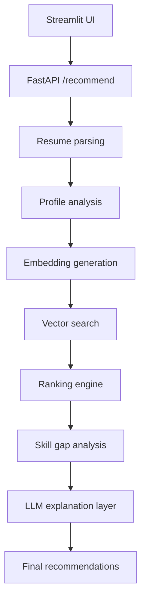

# AI Learning & Career Assistant

An AI-powered recommendation platform for students that analyses a resume, compares the profile to internship and career records, identifies skill gaps, and returns ranked recommendations with confidence scores, explanations, learning roadmaps, and interview tips. The ranking pipeline is deterministic and retrieval-based; the LLM is used only for explanation, summarisation, roadmap generation, and interview preparation guidance.

## Architecture Diagram



See `docs/architecture.md` for a longer version of the pipeline and the confidence formula.

## Setup Instructions

### Prerequisites
- Python 3.10 or newer
- `pip`
- Optional: a Gemini API key for explanation generation

### Steps
```bash
git clone https://github.com/rohit-joshi-01/AI-Learning-Career-Assistant
cd AI_Learning_Career_Assistant_Complete
python -m venv .venv
source .venv/bin/activate  # Windows: .venv\Scripts\activate
pip install -r requirements.txt
cp .env.example .env
# Fill in GEMINI_API_KEY if you want Gemini-powered explanations
python -m backend.services.data_loader
uvicorn backend.app:app --reload
streamlit run frontend/streamlit_app.py
```

### Notes
- The Streamlit app can also run in local fallback mode without the backend server by unchecking **Use FastAPI backend** in the sidebar.
- Resume uploads are processed in memory / temporary files and not stored permanently.

## Environment Variables

Copy `.env.example` to `.env` and fill in your values. Never commit `.env`.

| Variable | Purpose |
|---|---|
| `GEMINI_API_KEY` | Optional Gemini API key for the explanation layer |
| `CHROMA_PERSIST_DIR` | Directory used for the local vector store fallback |
| `DATA_DIR` | Dataset directory |
| `APP_LOG_LEVEL` | Logging level |
| `BACKEND_HOST` | FastAPI host |
| `BACKEND_PORT` | FastAPI port |
| `STREAMLIT_BACKEND_URL` | Backend URL used by the Streamlit sidebar |

## Dataset Sources and Licenses

All primary datasets in this repository are **synthetic and generated in-house** for the internship brief. No third-party data scraping was used.

| Dataset | Source | Synthetic? | License |
|---|---|---:|---|
| `datasets/internships.csv` | In-repo synthetic generation script | Yes | MIT / project-owned synthetic data |
| `datasets/careers.csv` | In-repo synthetic generation script | Yes | MIT / project-owned synthetic data |
| `datasets/learning_resources.csv` | Manually curated public learning resource URLs | Yes | MIT / project-owned synthetic data |
| `datasets/skill_taxonomy.csv` | In-repo synthetic/curated taxonomy | Yes | MIT / project-owned synthetic data |
| `datasets/sample_resume.pdf` | Synthetic sample resume bundled for testing | Yes | MIT / project-owned synthetic data |

## Confidence Score Formula

The score is computed from four components:

```text
score = (skill_match × 0.40)
      + (domain_match × 0.25)
      + (goal_alignment × 0.20)
      + (resource_availability × 0.15)
```

All component values are normalised to the range 0.0–1.0, and the final confidence score is shown as a percentage.

### Component Definitions
- **Skill Match (40%)**: fraction of required skills already present in the student profile.
- **Domain / Interest Match (25%)**: cosine similarity between the profile embedding and the record embedding.
- **Career Goal Alignment (20%)**: TF-IDF cosine similarity between the stated goal and the role description.
- **Learning Resource Availability (15%)**: fraction of missing skills that have at least one matching learning resource.

## Security & Responsible AI

- API keys are stored in `.env` and excluded via `.gitignore`.
- Uploaded resumes are processed locally and not stored permanently.
- Names, emails, and phone numbers are redacted from logs and parsed text.
- The UI includes an AI-generated content disclaimer.
- The LLM does not choose recommendations; it only explains already-ranked results.

## Known Limitations

- The project uses a local JSON vector-store fallback when ChromaDB is not installed.
- Gemini explanations fall back to deterministic templates if the API key or SDK is unavailable.
- Resume parsing is heuristic-based and may miss unusual formatting.
- The sample datasets are synthetic rather than scraped from live job boards.

## Future Improvements

- Replace the fallback store with a full persistent ChromaDB deployment.
- Add richer resume parsing for tables, images, and scanned PDFs.
- Expand the dataset with more real-world internship and career records.
- Add user authentication and a save/share workflow with privacy controls.

## Demo Video

Add your 3–5 minute demo video link here.

## Deliverables Included

- FastAPI backend
- Streamlit frontend
- Synthetic datasets
- Vector search and ranking pipeline
- Resume parsing
- Skill gap analysis
- LLM explanation layer with fallback
- Architecture documentation
