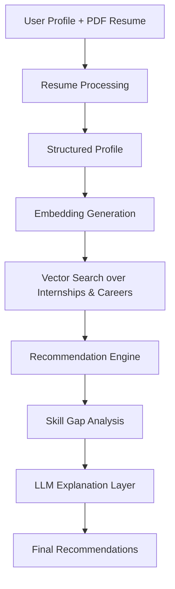

# System Architecture

The project follows a fixed recommendation pipeline. Ranking happens before the LLM is called.



## Mandatory Order

1. User profile capture
2. Resume processing
3. Profile analysis
4. Embedding generation
5. Vector search
6. Recommendation ranking
7. Skill gap analysis
8. LLM explanation
9. Final output

## Confidence Formula

```text
score = (skill_match × 0.40)
      + (domain_match × 0.25)
      + (goal_alignment × 0.20)
      + (resource_availability × 0.15)
```

## Data Flow

- `datasets/internships.csv` → local vector store
- `datasets/careers.csv` → local vector store
- `datasets/learning_resources.csv` → resource lookup dataframe
- Uploaded resume PDF → text extraction → profile object → embedding → search

## Deployment Notes

- The backend exposes `/recommend`, `/skill-gap`, `/internships`, and `/careers`.
- The Streamlit app can call the backend or use the local pipeline directly.
